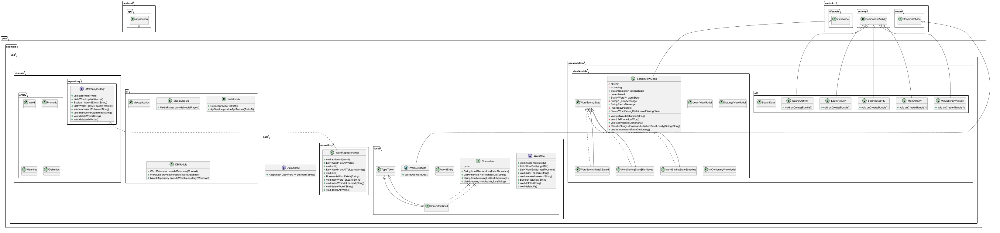

# YourEnglishDictionary

Android приложение для изучения иностранных слов с интерактивными карточками, а также с возможностью локального сохранения для последующего оффлайн доступа. Может также использоваться как обычный словарь.

## Overview
Для работы приложения используется бесплатный api: https://api.dictionaryapi.dev/

Приложение позволяет последовательно изучать слова, просматривая их транскрипцию, слушая их произношения, изучая их значения и примеры. Основной способ изучения - карточки. Пользователь может листать их:
- Свайп влево: слово выучено → удаляется из очереди текущей сессии
- Свайп вправо: слово ещё не запомнено → возвращается в конец очереди
- Tap по карточке: переворачивает карточку — на лицевой стороне только слово, на обороте — полный контент (фонетика, значения, примеры)

Если пользователь сохраняет слово в словарь (найдя его в поиске), то вся информация о слове (включая аудиозапись с произношением, если она есть) сохраняется на устройстве и пользователь может работать с ними без интернета.

В приложении реализован адаптивный интерфейс, так что оно хорошо смотрится и работает как на телефонах, так и на планшетах.

## Демонстрация работы


https://github.com/user-attachments/assets/51207616-de29-4cb9-b73c-d83f3ecdc900


## Технологический стек
- Язык: Kotlin (JVM target 11)
- UI: Jetpack Compose (Material3, Animation, Foundation)
- Архитектура: MVVM + Repository
- DI: Hilt
- БД: Room
- Сеть: Retrofit + Gson Converter

## Архитектура и слои
```
app/
  ├── domain/
  │     └── entity/
  |     └── repository
  ├── presentation/
  │     ├── ui/
  │     └── viewModels/
  ├── data/
```

## Применённые паттерны и практики
| Паттерн / Принцип         | Как применён                                                    |
| ------------------------- | --------------------------------------------------------------- |
| MVVM                      | Разделение UI (Compose) и логики (ViewModel)                    |
| Repository                | `IWordRepository` абстрагирует источник данных (Room / сеть)    |
| DI (Dependency Injection) | Hilt инжектит ViewModel и зависимости (Repository, MediaPlayer) |
| State Hoisting            | UI подписывается на `State<*>` из ViewModel                     |


## UML-схема


